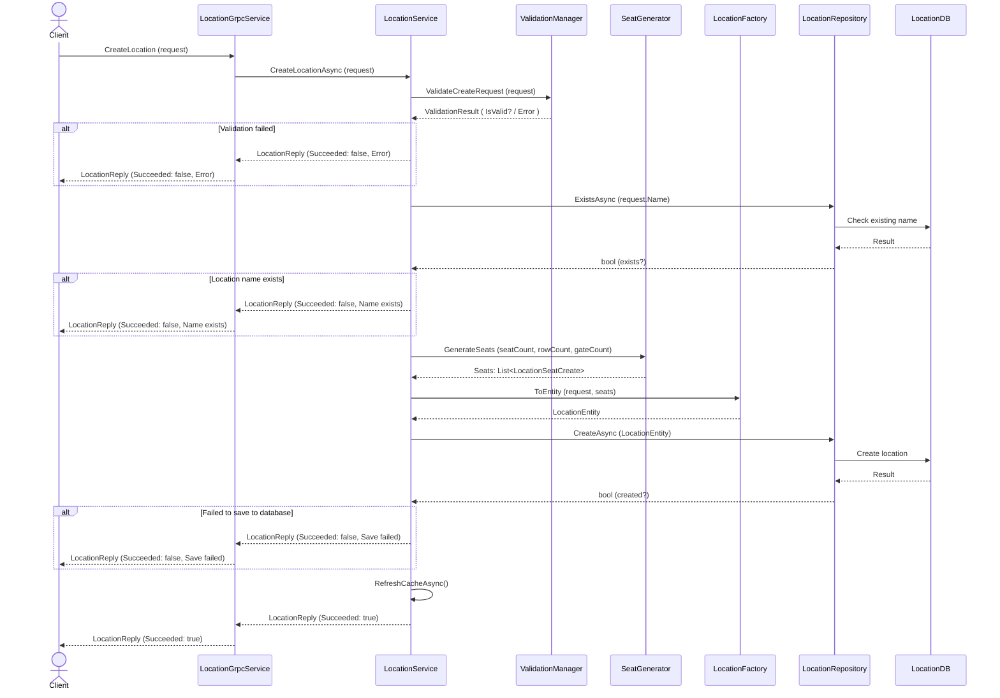

# LocationServiceProvider
A gRPC-based microservice for managing **event locations** with automatic generation of seat layouts based on input.

## How to Use as Client
Make sure to include an identical copy of the `protos/location.proto` file and configure it in the `.csproj` file.

### Required Packages
- Grpc.Net.Client
- Grpc.Net.ClientFactory
- Grpc.Tools
- Google.Protobuf

### Example Usage 
```csharp
//Generate gRPC channel and create client 
var channel = GrpcChannel.ForAddress("https://localhost:5000");
var client = new LocationServiceContract.LocationServiceContractClient(channel);

// Create a new location 
var createReply = await client.CreateLocationAsync(new LocationCreateRequest 
{ 
    Name = "3Arena",
    StreetName = "Arenaslingan 14",
    PostalCode = "12177",
    City = "Stockholm",
    SeatCount = 100,
    RowCount = 10,
    GateCount = 2
});

// Get a location by ID
var locationByIdReply = await client.GetLocationByIdAsync(new LocationByIdRequest 
{ 
    Id = "location-id"
});

// Get all locations
var allLocationsReply = await client.GetAllLocationsAsync(new Empty());

// Update a location
var updateReply = await client.UpdateLocationAsync(new LocationUpdateRequest 
{ 
    Id = "location-id",
    Name = "3Arena",
    StreetName = "Arenaslingan 14",
    PostalCode = "12177",
    City = "Stockholm",
    SeatCount = 100,
    RowCount = 10,
    GateCount = 2
});

// Delete a location
var deleteReply = await client.DeleteLocationAsync(new LocationByIdRequest
{
    Id = "location-id"
});
```
## Response Overview
All methods in `LocationServiceContract` return a response containing:
- `Succeeded*`: a **boolean** value indicating whether the operation was successful
- `ErrorMessage`: a **string** containing an error message (only set if the operation fails)

Additionally:
-  `GetLocationById` returns a `Location` object if found
-  `GetAllLocations` returns a list of `Location` objects

#### Location Object Structure
The `Location` object includes the following fields:
```json
{
    "id": "string",
    "name": "string",
    "streetName": "string",
    "postalCode": "string",
    "city": "string",
    "seats": [
        {
            "id": "string",
            "seatNumber": "string",
            "row": "string",
            "gate": "string"
        }
    ]
}
```

## Sequence Diagram 

### Create Location Process


